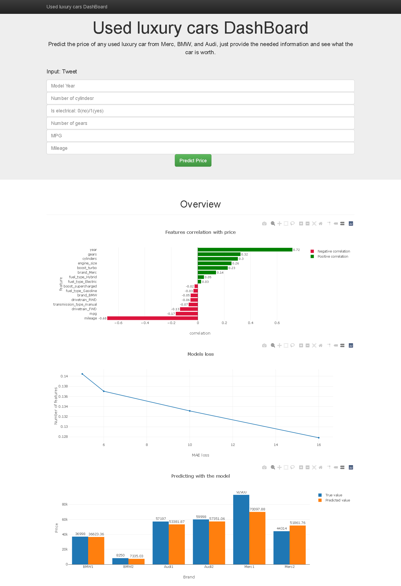

# Luxury Used Cars Price Prediction 
## Abstract
Estimating the right price for a used car is a long and exhausting process, so to find a solution for the issue this project started. The goal of the project is to create a model that predicts the prices of used cars based on several known data. This model can be useful for cars dealerships, people who are interested in cars that hold their value, first-time car owners who know nothing about car prices.
A new dealership that sells luxury cars is opening in town, and they want a model to predict the price of used cars. Automating the pricing process will help in getting a closer estimate for the actual prices in the market and will help in reducing many employees’ errors and expenses.

## Design
The dataset contains around 18000 with 15 features, 7 of which are categorical. A few feature highlights include drivetrain, mpg, fuel type, transmission, engine, mileage, brand, year, cylinders, transmission type, gears, boost. Some of the features were dropped and other grouped into more general categories, and an in-depth analysis of the rest of them was undertaken to inform baseline models and feature engineering.
## Data
The dataset contains around 18000 with 15 features, 7 of which are categorical. A few feature highlights include drivetrain, mpg, fuel type, transmission, engine, mileage, brand, year, cylinders, transmission type, gears, boost. Some of the features were dropped and other grouped into more general categories, and an in-depth analysis of the rest of them was undertaken to inform baseline models and feature engineering.
The data was scrapped from Cars.com because it is the second-largest automotive classified site and easy to collect data from. The focus was targeted on the three biggest luxury manufacturers in Germany BMW, Mercedes-Benz, and Audi.
The last predictions of used cars prices were drawn from multiple features such as year, selling price, mileage, fuel consumption, transmission, drive train, and number of cylinders.

## Algorithms
### Pre-processing
1-	Cleaned the data and impute the null, checked for duplicate, and delt outliers.  
2-	Created plots to visualize the relationships between the target and predictors, and between the variables themselves.  
3-	Decided which features to keep and which to drop.  

### Feature Engineering
1-	The categorical data were turned to numerical using dummy variables.  
2-	Combined the dummies to reduce the number of columns.  
3-	Turned price columns to price log.  
4-	Split data to train and test data.  

## Models
1-	Several linear regressions were developed, and we reduced the number of features in each one based on the coefficient of each model.  
2-	Pick and choose the best model with the right number of features to avoid the complexity and error.  

## Model Evaluation and Selection
1-	The dataset observations of 10860 were split into 70/30 train vs. test, and all scores were calculated with 10-fold cross validation on the whole data.  
2-	The evaluation of our models was based on the mean absolute error.  

## Tools
Tools: Python, and Jupyter Notebook. 
Libraries: BeautifulSoup, Requests, Pandas, Scikit-Learn, and Seaborn.  

## Communication
In addition to the slides, we made a [DashBoard](https://used-luxury-cars.herokuapp.com/) to show our results and use the model

